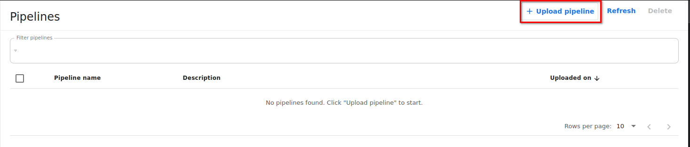
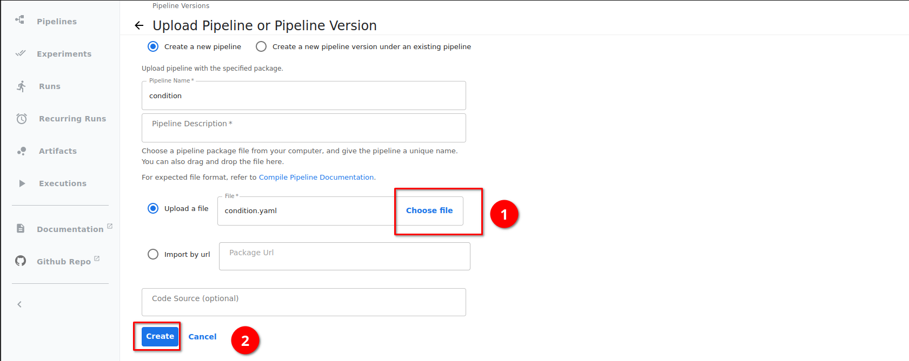
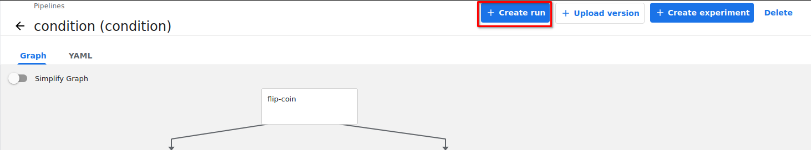
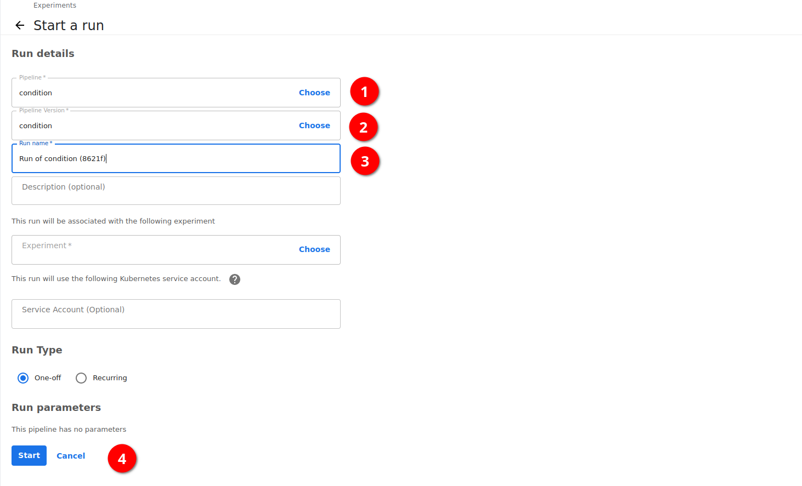
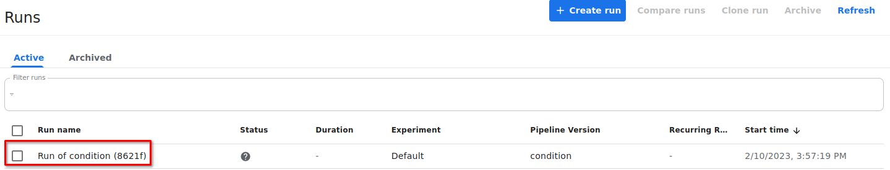
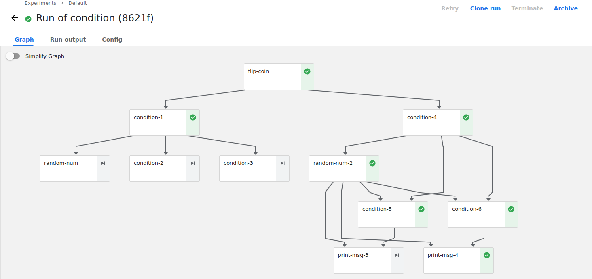
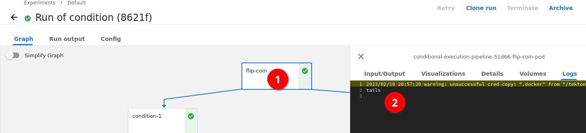

# Data Science Pipelines Operator

The Data Science Pipelines Operator (DSPO) is an OpenShift Operator that is used to deploy single namespace scoped 
Data Science Pipeline stacks onto individual OCP namespaces.

# Table of Contents

1. [Quickstart](#quickstart)
   1. [Pre-requisites](#pre-requisites)
   2. [Deploy the Operator via ODH](#deploy-the-operator-via-odh)
   3. [Deploy the Operator standalone](#deploy-the-operator-standalone)
   4. [Deploy DSP instance](#deploy-dsp-instance)
      1. [Deploy another DSP instance](#deploy-another-dsp-instance)
2. [DataSciencePipelinesApplication Component Overview](#datasciencepipelinesapplication-component-overview)
3. [Using a DataSciencePipelinesApplication](#using-a-datasciencepipelinesapplication)
   1. [Using the Graphical UI](#using-the-graphical-ui)
   2. [Using the API](#using-the-api)
4. [Cleanup](#cleanup)
   1. [Cleanup ODH Installation](#cleanup-odh-installation)
   2. [Cleanup Standalone Installation](#cleanup-standalone-installation)
5. [Run tests](#run-tests)

# Quickstart

To get started you will first need to satisfy the following pre-requisites:

## Pre-requisites
1. An OpenShift cluster that is 4.9 or higher.
2. You will need to be logged into this cluster as [cluster admin] via [oc client].
3. The OpenShift Cluster must have OpenShift Pipelines 1.7.2 or higher installed. Instructions [here][OCP Pipelines Operator].
4. Based on installation type you will need one of the following:
   1. For Standalone method: You will need to have [Kustomize] version 4.5+ installed
   2. For ODH method: The Open Data Hub operator needs to be installed. You can install it via [OperatorHub][installodh].

## Deploy the Operator via ODH

On a cluster with ODH installed, create a namespace where you would like to install DSPO: 

```bash
DSPO_NS=data-science-pipelines-operator
oc new-project ${DSPO_NS}
```

Then deploy the following `KfDef` into the namespace created above:

```bash
cat <<EOF | oc apply -f -
apiVersion: kfdef.apps.kubeflow.org/v1
kind: KfDef
metadata:
   name: data-science-pipelines-operator
   namespace: ${DSPO_NS}
spec:
   applications:
      - kustomizeConfig:
           repoRef:
              name: manifests
              path: data-science-pipelines-operator/
        name: data-science-pipelines-operator
   repos:
      - name: manifests
        uri: "https://github.com/opendatahub-io/odh-manifests/tarball/master"
EOF
```

Confirm the pods are successfully deployed and reach running state:

```bash
oc get pods -n ${DSPO_NS}
```

Once all pods are ready, we can proceed to deploying the first Data Science Pipelines (DSP) instance. Instructions
[here](#deploy-dsp-instance).

## Deploy the Operator standalone

First clone this repository: 

```bash
WORKING_DIR=$(mktemp -d)
git clone https://github.com/opendatahub-io/data-science-pipelines-operator.git ${WORKING_DIR}
```
If you already have the repository cloned, set `WORKING_DIR=` to its absolute location accordingly.

DSPO can be installed in any namespace, we'll deploy it in the following namespace, you may update this environment 
variable accordingly.

```bash
DSPO_NS=data-science-pipelines-operator

# Create the namespace if it doesn't already exist
oc new-project ${DSPO_NS}
```

Now we will navigate to the DSPO manifests then build and deploy them to this namespace.

```bash
cd ${WORKING_DIR}
make deploy
```

Confirm the pods are successfully deployed and reach running state:

```bash
oc get pods -n ${DSPO_NS}
```

Once all pods are ready, we can proceed to deploying the first Data Science Pipelines (DSP) instance. Instructions
[here](#deploy-dsp-instance).

## Deploy DSP instance

We'll deploy the first instance in the following namespace.

```bash
# You may update this value to the namespace you would like to use.
DSP_Namespace=test-ds-project-1
oc new-project ${DSP_Namespace}
```

DSPO introduces a new custom resource to your cluster called `DataSciencePipelinesApplication`. This resource is where you configure your DSP 
components, your DB and Storage configurations, and so forth. For now, we'll use the sample one provided, feel free to 
inspect this sample resource to see other configurable options.

```bash
cd ${WORKING_DIR}/config/samples
kustomize build . | oc -n ${DSP_Namespace} apply -f -
```

Confirm all pods reach ready state by running: 

```
oc get pods -n ${DSP_Namespace}
```

For instructions on how to use this DSP instance refer to these instructions: [here](#using-a-datasciencepipelinesapplication).

### Deploy another DSP instance 

You can use the DSPO to deploy multiple `DataSciencePipelinesApplication` instances in different OpenShift namespaces, for example earlier 
we deployed a `DataSciencePipelinesApplication` resource named `sample`. We can use this again and deploy it to a different namespace:

```bash
DSP_Namespace_2=test-ds-project-2
oc new-project ${DSP_Namespace_2}
cd ${WORKING_DIR}/config/samples
kustomize build . | oc -n ${DSP_Namespace_2} apply -f -
```

### Deploy a DSP with custom credentials

Using DSPO you can specify custom credentials for Database and Object storage. If specifying external connections, this 
is required. You can also provide secrets for the built in MariaDB and Minio deployments. To see a sample configuration 
you can simply investigate and deploy the following path: 

```bash
DSP_Namespace_3=test-ds-project-3
oc new-project ${DSP_Namespace_3}
cd ${WORKING_DIR}/config/samples/custom-configs
kustomize build . | oc -n ${DSP_Namespace_3} apply -f -
```

Notice the introduction of 2 `secrets` `testdbsecret`, `teststoragesecret` and 2 `configmaps` `custom-ui-configmap` and 
`custom-artifact-script`. The `secrets` allow you to provide your own credentials for the DB and MariaDB connections. 

These can be configured by the end user as needed.

# DataSciencePipelinesApplication Component Overview

When a `DataSciencePipelinesApplication` is deployed, the following components are deployed in the target namespace: 
* APIServer 
* Persistence Agent
* Scheduled Workflow controller
* Viewer CRD controller
* MLPipelines UI

If specified in the `DataSciencePipelinesApplication` resource, the following components may also be additionally deployed: 
* MariaDB
* Minio

To understand how these components interact with each other please refer to the upstream 
[Kubeflow Pipelines Architectural Overview] documentation.

# Using a DataSciencePipelinesApplication

When a `DataSciencePipelinesApplication` is deployed, use the MLPipelines UI endpoint to interact with DSP, either via a GUI or via API calls.

You can retrieve this route by running the following in your terminal: 

```bash
DSP_CR_NAME=sample
DSP_Namespace=test-ds-project-1
echo https://$(oc get routes -n ${DSP_Namespace} ds-pipeline-ui-${DSP_CR_NAME} --template={{.spec.host}})
```

## Using the Graphical UI

Navigate to the route retrieved in the last step. You will be presented with the MLPipelines UI. In this walkthrough we 
will upload a pipeline and start a run based off it.

To start, click the "Upload Pipeline" button.



Choose a file, you can use the [flipcoin example]. Download this example and select it for the first step. Then click 
"Create" for the second step.



Once done, you can now use this `Pipeline` to create a `Run`, do this by pressing "+ Create Run".



On this page specify the `Pipeline` we just uploaded if it's not already auto selected. Similarly with the version, 
with the example there will only be one version listed. Give this `Run` a name, or keep the default as is. Then click 
"Start".



Once you click start you will be navigated to the `Runs` page where you can see your previous runs that are have been 
executed, or currently executing. You can click the most recently started Run to view it's execution graph.



You should see something similar to the following once the `Run` completes.



Click the first "flip-coin" step. This step produces an output message either "heads" or "tails", confirm that you can 
see these logs after clicking this step and navigating to "Logs."



## Using the API

In the previous step we submitted a generated `Pipeline` yaml via the GUI. We can also submit the `Pipeline` code 
directly either locally or via a notebook.

You can find the `Pipeline` code example [here][flipcoin code example]. We can submit this to the DSP API Server by 
including this code in the following Python script:

```bash
cd ${WORKING_DIR}/docs/example_pipelines
touch execute_pipeline.py
```

We can utilize the flip coin example in this location and submit it directly to the API server by doing the following:

```python
# Add this to execute_pipeline.py we created earlier
import os
import kfp_tekton
from condition import flipcoin_pipeline
token = os.getenv("OCP_AUTH_TOKEN")
route = os.getenv("DSP_ROUTE")
client = kfp_tekton.TektonClient(host=route, existing_token=token)

client.create_run_from_pipeline_func(pipeline_func=flipcoin_pipeline, arguments={})
```

Retrieve your token and DSP route: 

```bash
# This is the namespace you deployed the DataSciencePipelinesApplication Custom Resource
DSP_Namespace=test-ds-project-1
# This is the metadata.name of that DataSciencePipelinesApplication Custom Resource
DSP_CR_NAME=sample
export DSP_ROUTE="https://$(oc get routes -n ${DSP_Namespace} ds-pipeline-ui-${DSP_CR_NAME} --template={{.spec.host}})"
export OCP_AUTH_TOKEN=$(oc whoami --show-token)
```

And finally execute this script and submit the flip coin example: 

```bash
python execute_pipeline.py
```

You can navigate to the UI again and find your newly created run there, or you could amend the script above and list 
the runs via `client.list_runs()`.

# Cleanup

To remove a `DataSciencePipelinesApplication` from your custer, run: 

```bash
# Replace environment variables accordingly
oc delete ${YOUR_DSPIPELINE_NAME} -n ${YOUR_DSPIPELINES_NAMESPACE}
```

The DSPO will clean up all manifests associated with each `DataSciencePipelinesApplication` instance.

Or you can remove all `DataSciencePipelinesApplication` instances in your whole cluster by running the following: 

```bash
oc delete DataSciencePipelinesApplication --all -A
```

Depending on how you installed DSPO, follow the instructions below accordingly to remove the operator:

## Cleanup ODH Installation

To uninstall DSPO via ODH run the following:

```bash
KFDEF_NAME=data-science-pipelines-operator
oc delete kfdef ${KFDEF_NAME} -n ${DSPO_NS}
```

## Cleanup Standalone Installation

To clean up standalone DSPO deployment:

```bash
# WORKING_DIR must be the root of this repository's clone
cd ${WORKING_DIR}
make undeploy
oc delete project ${DSPO_NS}
```

# Run tests 

Simply clone the directory and execute `make test`.

To run it without `make` you can run the following: 
```bash
tmpFolder=$(mktemp -d)
go install sigs.k8s.io/controller-runtime/tools/setup-envtest@latest
export KUBEBUILDER_ASSETS=$(${GOPATH}/bin/setup-envtest use 1.25.0 --bin-dir ${tmpFolder}/bin -p path)
go test ./... -coverprofile cover.out

# once $KUBEBUILDER_ASSETS you can also run the full test suite successfully by running:
pre-commit run --all-files
```

You can find a more permanent location to install `setup-envtest` into on your local filesystem and export 
`KUBEBUILDER_ASSETS` into your `.bashrc` or equivalent. By doing this you can always run `pre-commit run --all-files` 
without having to repeat these steps.

[cluster admin]: https://docs.openshift.com/container-platform/4.12/authentication/using-rbac.html#creating-cluster-admin_using-rbac
[oc client]: https://mirror.openshift.com/pub/openshift-v4/x86_64/clients/ocp/latest/openshift-client-linux.tar.gz
[OCP Pipelines Operator]: https://docs.openshift.com/container-platform/4.12/cicd/pipelines/installing-pipelines.html#op-installing-pipelines-operator-in-web-console_installing-pipelines
[Kustomize]: https://kubectl.docs.kubernetes.io/installation/kustomize/
[Kubeflow Pipelines Architectural Overview]: https://www.kubeflow.org/docs/components/pipelines/v1/introduction/#architectural-overview
[flipcoin example]: https://github.com/opendatahub-io/data-science-pipelines-operator/blob/main/docs/example_pipelines/condition.yaml
[flipcoin code example]: https://github.com/opendatahub-io/data-science-pipelines-operator/blob/main/docs/example_pipelines/condition.py
[installodh]: https://opendatahub.io/docs/getting-started/quick-installation.html
