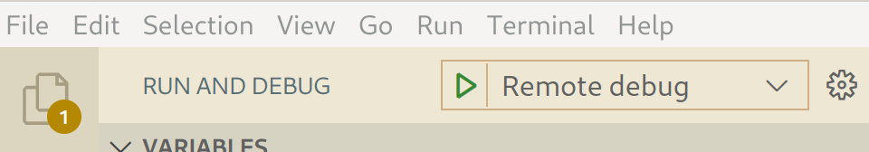
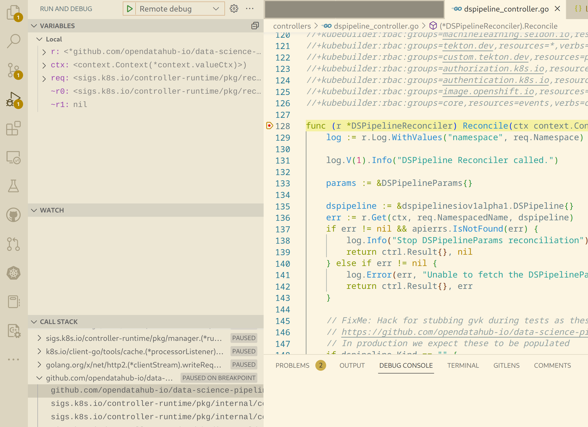

# Debugging Data Science Pipelines Operator

It's easy to do remote debugging of DSPO using some helper make targets:

* `podman-build-debug`: builds the container image with delve installed, and uses go compilation flags required for debugging
* `deploy-debug`: deploys a modified Deployment that runs a single replica of the container with delve listening on :2345

## Example

```bash
oc login https:// ...
oc project <namespace where operator is running>
```

Assuming the normal (non-debugging) deployment is running, there will be 3 replicas:
```bash
oc get pods

NAME                                                   READY   STATUS    RESTARTS   AGE
data-science-pipelines-operator-controller-manager-1   1/1     Running   0          10m
data-science-pipelines-operator-controller-manager-2   1/1     Running   0          10m
data-science-pipelines-operator-controller-manager-3   1/1     Running   0          10m
```

Build the debug image and push it to your quay org:
```bash
make podman-build-debug podman-push IMG=quay.io/yourname/data-science-pipelines-operator:latest
```

Deploy it:
```bash
make deploy-debug IMG=quay.io/yourname/data-science-pipelines-operator:latest
```

You should now see only 1 pod running:
```bash
oc get pods

NAME                                                   READY   STATUS    RESTARTS   AGE
data-science-pipelines-operator-controller-manager-1   1/1     Running   0          10m
```

The container is configured to run delve, listening on :2345 for debugging connections:
```bash
oc describe pod data-science-pipelines-operator-controller-manager-1 | grep 2345

  --listen=:2345
```

Forward local port 2345 to the pod's 2345:
```bash
oc port-forward data-science-pipelines-operator-controller-manager-1 2345

Forwarding from 127.0.0.1:2345 -> 2345
```

Now connect your local debugger to localhost port 2345. If you're using VS Code, you can run the `Remote debug` launch configuration that's included with this project's source code.



To test your debugger, set a breakpoint in `dspipeline_controller.go` on the `Reconcile` method, and then make a change to any `DSPipeline` CR. Your IDE or debugger should break at that breakpoint. Note that if you leave the debugger paused for too long, the Kubernetes readiness check will fail and the pod will be restarted, killing your debugging session.


